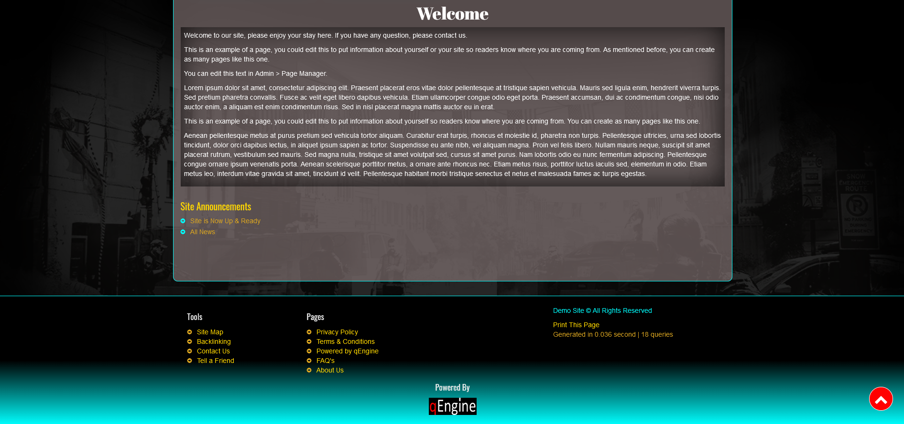

# README.md

_For full version of readme, please refer to the original author documentation in /doc/readme.html_

## Info for theme Aqua-Dark for Kemana Directory
Note: This theme was developed for the Kemana Directory script. If you don't have this script,
you can visit https://www.c97.net to download the free script before using this theme.

This theme was designed based on the theme (default). I found that the layout is overall very good.
So I made very little change to the layout. However, I added more styles to give life to Kemana.

## Changelog
1. I opted for a fixed position on the top menu. (The menu is now accessible at all times.
2. I took out the logo from the top menu. (The logo was too small for my taste.) The logo and the text can be added from the administration. I used the footer and navbar php
3. I built a mini header under the menu to put the logo and brand site on it. Add tag title on logo, the brand title in center.
4. I adding background images in png. I fixed the image to give an effect. The site seems to slide on the image. The image adapts to all screen resolutions.
5. To make it a little more dynamic, I added several different effects on several areas.
6. Adding an arrow to return to the top. No need to scroll down to go back to the top, Only need to click on the arrow.
7. I changed the copyright of the author's developer. I only put the link in blank. In this way another window opens and visitors do not leave the users' site.
8. I modified the right of the owner of the site, now only the name of the site appears without the slogan of the site.
The slogan is present in the header in a scrolling and very visible text.

## Structure
Some folders and files have been added to facilitate customization of the Aqua - Dark theme. It's easier to edit from the theme root. Here are the details of the structure.
Note: Do not delete these folders or files, they are necessary to make the theme look.

  
**Aqua-Dark**
In the Aqua-Dark theme, you will find 1 new file. The file "assets".
The assets folder contains the files and folders necessary for the Aqua-Dark theme style.

  
**Folder "assets"**
The "assets' folder contains 3 folders: "css", "imgs" and "js". These are the contents of its files that you can modify.

  
**File "css"**
This file content all stylesheets for the theme "aqua-dark". The "aqua-dark.css" content all colors and effect for the theme.
The stylesheet "custom.css" are empty. You can add your style in this stylesheet, its for you.
The stylesheet "responsive.css" contains the adjustments for the different screen resolutions.

  
**Folder "imgs"**
The "imgs' folder content only images used on the theme "Aqua-Dark".

## Screenshots
** Header **
  

** Featured **
  

** Newest **
  

** Welcome Footer **
  

** Details **
  

## FAQs

### Why this theme?
Kemana-Directory is a great script. The developer has worked very hard to offer a quality script.
Since I use the script and having the necessary knowledge, I wanted to get involved and offer a little life to its script.
I will do other themes in the future.

### What is the size of the logo?
The width of the logo is automatically set to a maximum width of 250px.
The height of the logo is automatically set to a maximum height of 150px.
You can ajust size in css in class "brand-logo img" for your need.

### Others projets for Kermana?
Yes, But the priority is to correct any bugs in this theme.
If you are aware of some bugs, please send an email to "contact@hostingwolf.ca" and i update.
Please don't forget to provide the details, the url of the problem and resolution screen.
